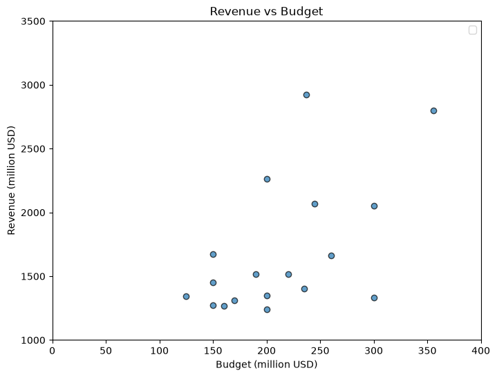
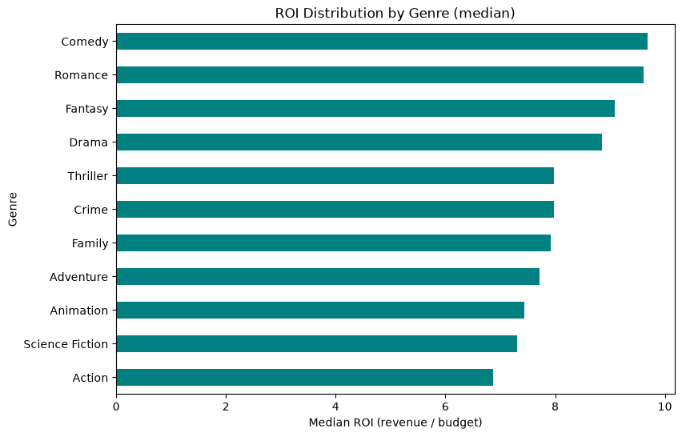
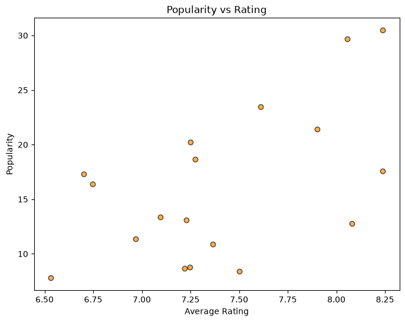
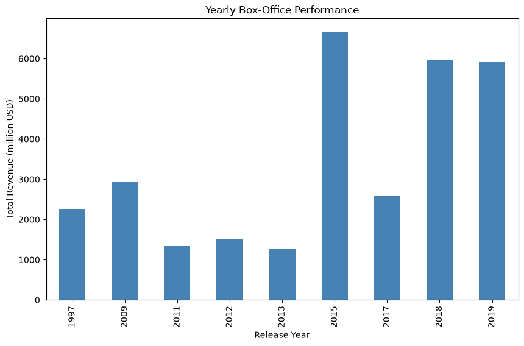
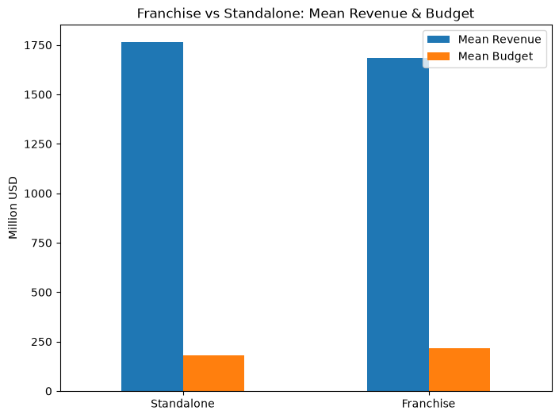

# TMDB Movie Data Analysis

### Financial, Popularity & Franchise Performance of 18 Blockbuster Films

**Prepared by:** Mukama Francois
**Date:** July 17, 2026
**Data source:** The Movie Database (TMDB) API
**Tools:** Python, Pandas, NumPy, Matplotlib

---

## 1. Introduction

This report presents an end-to-end analysis of 18 high-grossing feature films retrieved from The Movie Database (TMDB) API. For each film, movie-level details and full cast/crew credits were fetched in a single request, cleaned into a consistent 22-column dataset, and analysed across three dimensions: financial performance, audience reception, and franchise/director success.

The brief listed 19 movie IDs; one (id 0) is not a valid TMDB record and returned HTTP 404, so it was skipped automatically, leaving 18 films for analysis. Collectively these films earned approximately **$30.5 billion** in worldwide revenue against production budgets ranging from $125M (*Harry Potter and the Deathly Hallows: Part 2*) to $356M (*Avengers: Endgame*). Every film in the sample was profitable — even the lowest-profit title cleared $1.0 billion — which reflects the deliberately blockbuster-heavy composition of the selection. Sixteen of the eighteen films belong to a franchise; only two, *Titanic* and *Beauty and the Beast*, are standalone releases.

## 2. Methodology

The workflow was implemented as a set of single-purpose Python modules orchestrated from a Jupyter notebook, mirroring the four project steps:

**Ingestion.** Each movie was requested from the TMDB movie-details endpoint with `append_to_response=credits`, so details and cast/crew arrive together. Invalid IDs are skipped, and the results are assembled into a single raw DataFrame.

**Preprocessing.** Irrelevant columns were dropped; nested JSON-like fields (genres, cast, production companies, spoken languages, collection) were flattened into pipe-separated text; budget and revenue were converted to millions of USD; impossible values (zero budget, revenue or runtime, and ratings on zero votes) were replaced with NaN; duplicates and rows without an id or title were removed; and only films with status "Released" were retained. The result is the final 22-column schema.

**Analysis.** A single reusable ranking function powers all key performance indicators (KPIs). Two derived metrics are used throughout: Profit = Revenue − Budget, and ROI = Revenue/Budget. To avoid misleading extremes, ROI rankings include only films with a budget >= $10M, and rating rankings include only films with >= 10 votes.

**Visualization.** Five Matplotlib charts summarise the financial and reception patterns and are reproduced in Section 4.

## 3. Key Findings

### 3.1 Best and Worst Performing Movies

*Avatar* leads on revenue, profit and return on investment, while the Marvel Avengers films dominate audience engagement (vote counts and ratings). Notably, the sample contains no commercial failures — the "lowest profit" films are simply the least spectacularly profitable, each still earning over $1 billion.

**Highest Revenue**

| Movie | Revenue ($M) |
| --- | --- |
| Avatar | 2,923.71 |
| Avengers: Endgame | 2,799.44 |
| Titanic | 2,264.16 |
| Star Wars: The Force Awakens | 2,068.22 |
| Avengers: Infinity War | 2,052.42 |

**Highest Budget**

| Movie | Budget ($M) |
| --- | --- |
| Avengers: Endgame | 356.0 |
| Avengers: Infinity War | 300.0 |
| Star Wars: The Last Jedi | 300.0 |
| The Lion King | 260.0 |
| Star Wars: The Force Awakens | 245.0 |

**Highest Profit (Revenue − Budget)**

| Movie | Profit ($M) | Revenue ($M) | Budget ($M) |
| --- | --- | --- | --- |
| Avatar | 2,686.71 | 2,923.71 | 237.0 |
| Avengers: Endgame | 2,443.44 | 2,799.44 | 356.0 |
| Titanic | 2,064.16 | 2,264.16 | 200.0 |
| Star Wars: The Force Awakens | 1,823.22 | 2,068.22 | 245.0 |
| Avengers: Infinity War | 1,752.42 | 2,052.42 | 300.0 |

**Lowest Profit (all still highly profitable)**

| Movie | Profit ($M) | Revenue ($M) | Budget ($M) |
| --- | --- | --- | --- |
| Star Wars: The Last Jedi | 1,034.41 | 1,334.41 | 300.0 |
| Incredibles 2 | 1,043.23 | 1,243.23 | 200.0 |
| Beauty and the Beast | 1,106.12 | 1,266.12 | 160.0 |
| Frozen | 1,124.22 | 1,274.22 | 150.0 |
| Jurassic World: Fallen Kingdom | 1,140.47 | 1,310.47 | 170.0 |

**Highest ROI (budget ≥ $10M)**

| Movie | ROI | Revenue ($M) | Budget ($M) |
| --- | --- | --- | --- |
| Avatar | 12.34 | 2,923.71 | 237.0 |
| Titanic | 11.32 | 2,264.16 | 200.0 |
| Jurassic World | 11.14 | 1,671.54 | 150.0 |
| Harry Potter and the Deathly Hallows: Part 2 | 10.73 | 1,341.51 | 125.0 |
| Frozen II | 9.69 | 1,453.68 | 150.0 |

**Lowest ROI (budget ≥ $10M)**

| Movie | ROI | Revenue ($M) | Budget ($M) |
| --- | --- | --- | --- |
| Star Wars: The Last Jedi | 4.45 | 1,334.41 | 300.0 |
| Avengers: Age of Ultron | 5.98 | 1,405.40 | 235.0 |
| Incredibles 2 | 6.22 | 1,243.23 | 200.0 |
| The Lion King | 6.39 | 1,662.02 | 260.0 |
| Black Panther | 6.75 | 1,349.93 | 200.0 |

**Most Voted**

| Movie | Vote Count |
| --- | --- |
| The Avengers | 38,770 |
| Avatar | 34,226 |
| Avengers: Infinity War | 32,286 |
| Avengers: Endgame | 28,027 |
| Titanic | 27,354 |

**Highest Rated (≥ 10 votes)**

| Movie | Rating | Vote Count |
| --- | --- | --- |
| Avengers: Endgame | 8.239 | 28,027 |
| Avengers: Infinity War | 8.239 | 32,286 |
| Harry Potter and the Deathly Hallows: Part 2 | 8.080 | 22,132 |
| The Avengers | 8.056 | 38,766 |
| Titanic | 7.902 | 27,354 |

**Lowest Rated (≥ 10 votes)**

| Movie | Rating | Vote Count |
| --- | --- | --- |
| Jurassic World: Fallen Kingdom | 6.531 | 12,847 |
| Jurassic World | 6.702 | 21,686 |
| Star Wars: The Last Jedi | 6.747 | 16,440 |
| Beauty and the Beast | 6.967 | 16,062 |
| The Lion King | 7.096 | 10,797 |

**Most Popular**

| Movie | Popularity |
| --- | --- |
| Avengers: Infinity War | 30.46 |
| The Avengers | 29.66 |
| Avatar | 23.46 |
| Titanic | 21.40 |
| Frozen | 20.25 |

### 3.2 Advanced Search Queries

Two targeted searches were run against the dataset. Both returned zero rows, which is the correct result for this particular sample rather than a bug: the 18 films are all major franchise blockbusters, and none of them is a Bruce Willis science-fiction/action title or a Uma Thurman – Quentin Tarantino collaboration. The queries executed correctly and simply found no matches.

- **Search 1** — best-rated Science-Fiction/Action films starring Bruce Willis: no matching films.
- **Search 2** — films starring Uma Thurman and directed by Quentin Tarantino: no matching films.

A broader dataset would be required to surface positive matches.

### 3.3 Franchise vs. Standalone Performance

Standalone films show a slightly higher mean revenue and a noticeably lower mean budget than franchise films, which translates into a higher median ROI (9.62 vs. 7.79). Ratings and popularity are almost identical between the two groups. This apparent standalone advantage should be read with strong caution: the standalone group contains only two films (*Titanic* and *Beauty and the Beast*), so the averages are not statistically robust.

| Group | Mean Rev ($M) | Median ROI | Mean Budget ($M) | Mean Popularity | Mean Rating |
| --- | --- | --- | --- | --- | --- |
| Standalone (n=2) | 1,765.14 | 9.62 | 180.0 | 16.39 | 7.43 |
| Franchise (n=16) | 1,682.78 | 7.79 | 218.0 | 16.09 | 7.40 |

### 3.4 Most Successful Franchises

Ranked by total revenue (collections with at least two films in the dataset), the Marvel Avengers Collection is in a league of its own: four films generating a combined $7.78 billion at the highest mean rating (7.95). Star Wars, Jurassic Park and Frozen follow, each represented by two films.

| Collection | Movies | Tot. Budget | Mean Budget | Tot. Revenue | Mean Revenue | Mean Rating |
| --- | --- | --- | --- | --- | --- | --- |
| The Avengers Collection | 4 | 1,111.0 | 277.75 | 7,776.07 | 1,944.02 | 7.95 |
| Star Wars Collection | 2 | 545.0 | 272.50 | 3,402.63 | 1,701.32 | 7.00 |
| Jurassic Park Collection | 2 | 320.0 | 160.00 | 2,982.01 | 1,491.00 | 6.62 |
| Frozen Collection | 2 | 300.0 | 150.00 | 2,727.90 | 1,363.95 | 7.24 |

*Budget and revenue figures are in millions of USD.*

### 3.5 Most Successful Directors

James Cameron records the highest total revenue ($5.19 billion) from just two films. The Russo brothers follow with $4.85 billion (*Infinity War* and *Endgame*) and the highest mean rating in the table (8.24). Because the Avengers films are co-directed, revenue is credited to both directors, which is why several pairs share identical totals.

| Director | Movies | Total Revenue ($M) | Mean Rating |
| --- | --- | --- | --- |
| James Cameron | 2 | 5,187.87 | 7.76 |
| Anthony Russo | 2 | 4,851.85 | 8.24 |
| Joe Russo | 2 | 4,851.85 | 8.24 |
| Joss Whedon | 2 | 2,924.22 | 7.67 |
| Jennifer Lee | 2 | 2,727.90 | 7.24 |
| Chris Buck | 2 | 2,727.90 | 7.24 |
| J.J. Abrams | 1 | 2,068.22 | 7.25 |
| Colin Trevorrow | 1 | 1,671.54 | 6.70 |
| Jon Favreau | 1 | 1,662.02 | 7.10 |
| James Wan | 1 | 1,515.40 | 7.22 |
| Ryan Coogler | 1 | 1,349.93 | 7.36 |
| David Yates | 1 | 1,341.51 | 8.08 |
| Rian Johnson | 1 | 1,334.41 | 6.75 |
| J. A. Bayona | 1 | 1,310.47 | 6.53 |
| Bill Condon | 1 | 1,266.12 | 6.97 |
| Brad Bird | 1 | 1,243.23 | 7.50 |

## 4. Visual Insights

### 4.1 Revenue vs. Budget

Every film sits far above the break-even line, confirming universal profitability. Budgets are compressed into a narrow $125M–$356M band while revenues span $1.2B–$2.9B, so success in this sample is driven far more by revenue upside than by budget size.

*Figure 1. Revenue vs. budget (millions USD), with the break-even line.*

### 4.2 ROI Distribution by Genre

Median ROI is highest for Comedy and Romance (~9.6) and lowest for Action and Science Fiction (~7). Because films carry multiple genres, each film contributes to several bars; the pattern suggests lower-budget genres convert to proportionally higher returns even when their absolute revenues are smaller.

*Figure 2. Median ROI by genre.*

### 4.3 Popularity vs. Rating

There is a weak positive association between rating and popularity. The two most popular titles (*The Avengers* and *Avengers: Infinity War*) are also among the highest rated, but the wide scatter shows that popularity is not fully explained by critical reception.

*Figure 3. Popularity vs. average rating.*

### 4.4 Yearly Box-Office Performance

Total revenue peaks sharply in 2015 (approx. $6.7B, driven by *The Force Awakens*, *Jurassic World*, *Furious 7* and *Age of Ultron*), with 2018 and 2019 close behind (approx. $5.9B each). The pattern reflects how many of the sampled blockbusters clustered in the second half of the 2010s.

*Figure 4. Total revenue by release year (millions USD).*

### 4.5 Franchise vs. Standalone Success

Standalone films show marginally higher mean revenue on a lower mean budget, but with only two standalone titles this comparison is indicative rather than conclusive.

*Figure 5. Mean revenue and budget: franchise vs. standalone.*

## 5. Conclusion

Across these 18 blockbusters, financial success was universal and driven primarily by revenue rather than spend: *Avatar* leads on revenue, profit and ROI, while the Avengers franchise dominates audience engagement and, as a collection, out-earns every other franchise. Franchise and standalone films performed comparably on ratings and popularity, and the modest standalone edge in ROI rests on a very small sample. Median ROI was highest in lower-budget genres such as Comedy and Romance, and box-office output concentrated heavily in 2015 and 2018–2019.

Key limitations:

- The dataset is a curated set of 18 top-grossing films, not a representative sample of the film industry, so figures skew heavily toward the profitable extreme.
- The standalone group contains only two films, limiting the reliability of franchise-vs-standalone comparisons.
- Both advanced searches returned no matches, confirming the query logic but underscoring the narrow scope of the sample.
- TMDB popularity is a time-sensitive, engagement-based metric and can shift between data pulls.